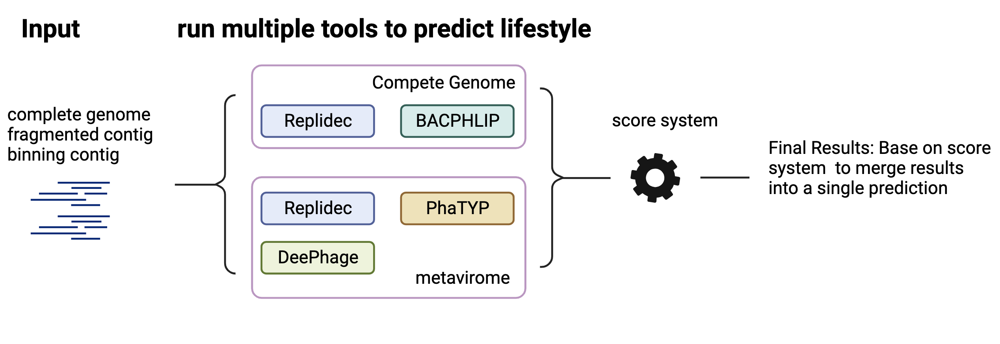

# RepliDecPlus

RepliDecPlus integrate tools for predict phage replication cycle.

**Current support: RepliDec, PhaBOX/phaTYP, BACPHLIP, DeePhage.**


## Introduction



RepliDecPlus has 3 steps:
1. Running individual tools.

    * RepliDec used for complete genomes and metagenomic assemblies; 
    *  PhaBOX/phaTYP and DeePhage for metagenomic assemblies; 
    * BACPHLIP for complete genomes;

2. Collect resultes and scores from these tools.
    * After running each software, we used a custom script to calculate the replication cycle of each input sequences in the same bin in PhaBOX/phaTYP and DeePhage.  Becasue they will treat each sequence as a seperate query, which will cause sequences from same bin have multiple replication cycle.
    
3. Use the an in-house scoring system to re-calculate the confidence for the final prediction.
    * Following the evaluation results, we have formulated a comprehensive scoring system. This system is instrumental in assigning appropriate weights to the confidence levels associated with each result, thereby facilitating the derivation of a refined final prediction.


## Installation 
We prepare the environment use **Conda/Docker**. You can choose one of them to use it.

### 1. Conda

### 1.1 Conda installation (If you have, please skip it)

```
## linux
mkdir -p ~/miniconda3
wget https://repo.anaconda.com/miniconda/Miniconda3-latest-Linux-x86_64.sh -O ~/miniconda3/miniconda.sh
bash ~/miniconda3/miniconda.sh -b -u -p ~/miniconda3
rm -rf ~/miniconda3/miniconda.sh
```
Other platform please follow this download url: https://docs.conda.io/projects/miniconda/en/latest/

**PS: Because some software can run only on Linux, so we recommand use linux based system.**

### 1.2 Clone RepliDecPlus Git repository and set up a Conda environment and all necssary dependent packages

```
git clone https://github.com/pengSherryYel/ReplidecPlus.git
cd ReplidecPlus
sh ./prepare_env.sh
```
`prepare_env.sh` not only prepare the environment but also install all the related packages.

### 2. Docker

### 2.1 Pull Docker image
```
docker pull pengsherry/replidec_plus

```


## Success Installation 

After success prepare the environment and packages. There will be five conda environment genererted. All five enviroment will startswith "RP". 
1. RP_base: main environment
2. RP_bacphlip：environment for BACPHIP
3. RP_deephage: environment for DeePhage
4. RP_phabox: environment for PhaTYP/PhaBOX
5. RP_replidec: environment for RepliDec

To check the installation, you can use following commands to check
```
## for conda
conda info -e

## for docker
docker run pengsherry/replidec_plus conda info -e
```


## Usage
current support: **RepliDec, PhaBOX/phaTYP, BACPHLIP, DeePhage**. 

### Qucik start
If you use conda, you can use these commands to run
```
## for conda
conda activate RP_base
python ReplidecPlus/ReplidecPlus.py -i input.txt -r -p -b -d -t 10
```

If you use Docker, you can use the command below. 
Please pay attention for "**-v \`pwd\`:/data**". This will mount your local folder to folder /data within Docker image. You can change to any local folder, but **please keep /data**, for example: `-v your_folder:/data`. 
And please put your input in your mounted local folder, so that the software can access them.
```
docker run -v `pwd`:/data pengsherry/replidec_plus conda run -n RP_base python ReplidecPlus/ReplidecPlus.py -i
/data/input.txt -o /data/ReplidecPlus -r -p -b -d -t 10
```


### INPUT (TEXT OR FASTA file) (`-i`)
* TEXT

  To support the binning results. we use text file as input (`-i`). This file is a **two columns tab seperated file**.
  1. first column: sampleID which will used as identifier in the output file.
  2. second column: sequence path(Nucleic Acids Sequences).

  ```
  ###
  NC_001447.1      $path/NC_001447.1.fasta
  NC_023556.1      $path/NC_023556.1.fasta
  ```

* FASTA

  RepliDecPlus can not direct use fasta file. We prepare a scirpt to transform fasta file into text format
  ```
  ## for Conda
  sh ReplidecPlus/utility/fasta2list.sh your_query_seq.fasta sequence.list split_dir 

  ## for Docker (this will add /data prefix for each sequence)
  docker run -v `pwd`:/data pengsherry/replidec_plus python ReplidecPlus/utility/fasta2list_forDocker.sh
  /data/your_query_seq.fasta /data/sequence.list /data/split_dir
  ```

### Output (`-o`)
There will be four folders generate under the path set by `-o`, default is current workdir. Moreover two important files that combine all predictions from these tools.

**FOLDER**: store the results from each tools
1. bacphlip  
2. deephage  
3. phabox  
4. replidec

**File**: main outputs

1. ReplidecPlus.summary.detail.txt

    Merged results of prediction detail from each tools.

2. ReplidecPlus.summary.final.txt

    Final prediction of merged weighted results from each tools.

### parameters
```
Usage: python RepliPhage.py -i  -r -p -b -a -d

options:
  -h, --help            show this help message and exit
  --version             show program's version number and exit
  -i I                  input file, two cloumn. sample seqence_path. tab sepearte.
  -o O                  path to deposit output folder and temporary files, will create if doesn't exist [default= working directory]
  -t T                  thread number used in each software
  -r, --replidec        run replidec
  -rd {all,prokaryote}, --replidec_db {all,prokaryote}
                        define replidec database
  -rp REPLIDEC_PARA, --replidec_parameter REPLIDEC_PARA
                        define replidec parameter
  -rf, --replidecF      force rerun replidec
  -d, --deephage        run deephage
  -df, --deephageF      force rerun deephage
  -b, --bacphlip        run bacphlip
  -bf, --bacphlipF      force rerun bacphlipF
  -p, --phabox          run phaTYP from PhaBOX
  -pp PHABOX_PARA, --phabox_parameter PHABOX_PARA
                        define phabox parameter
  -pf, --phaboxF        force rerun phaTYP

```

## Example (Conda)
```
#!/usr/bin/bash
conda activate RP_base
cd example
sh ../utility/fasta2list.sh sequences.fasta sequence.list sequence_split 
python ../ReplidecPlus.py -i sequence.list -o example_repliplus -t 4 -r -b -p -d 
```


## Known issues
1. the minimum length of input sequence is 3k bp. If the length is too short, it will significantly infulece the prediction accuracy.
2. RepliDec Plus will take long time to predict very large dataset. if possible, you can seperate the input query sequences into small ones. Then run them parallel. This will save a lot of time.


## References

## Citation


